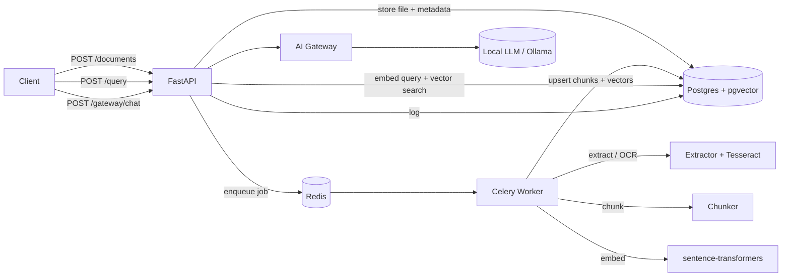
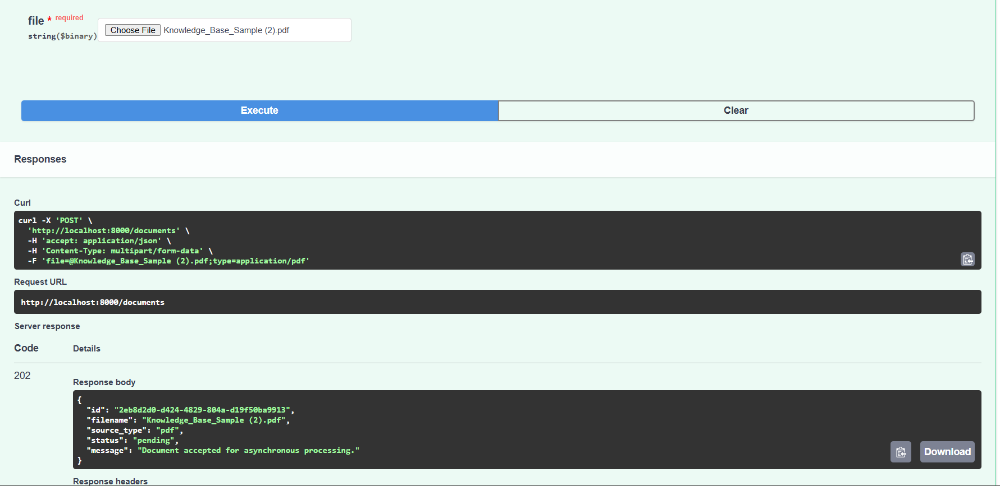
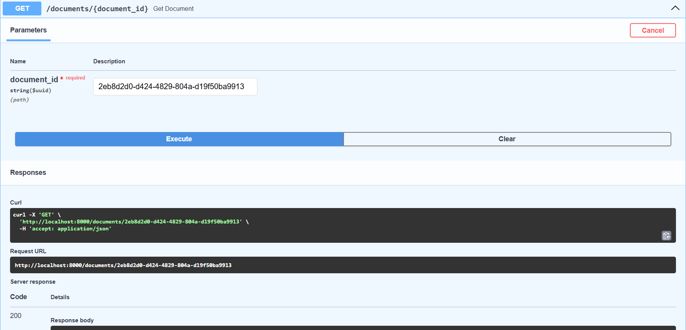
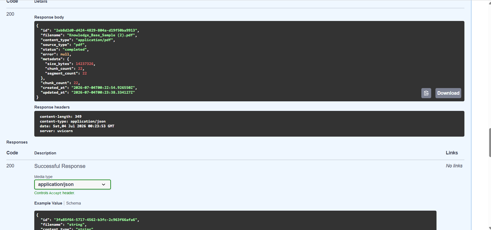
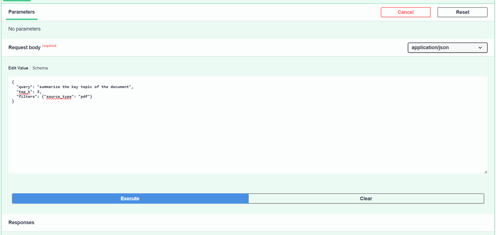
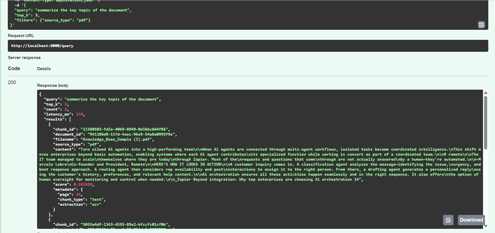
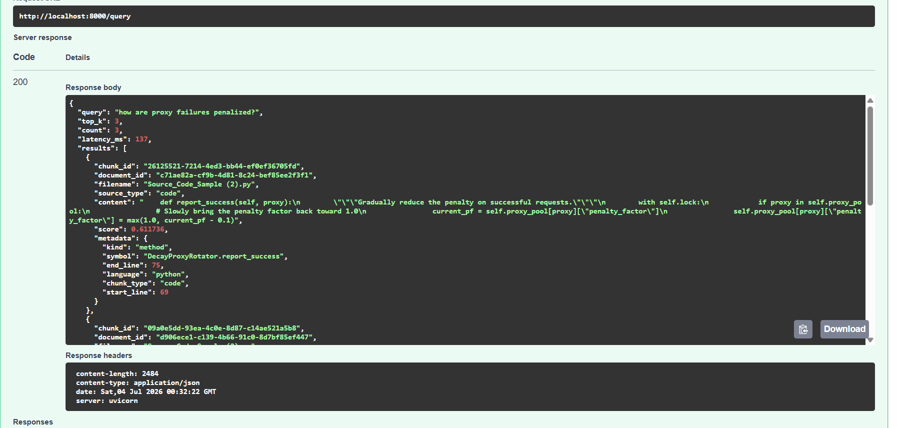

# Internal AI Knowledge Platform (RAG Backend)

A production-style backend that lets internal developers upload documents/code, run
natural-language semantic search over them, and access LLMs through a single
centralized AI Gateway. Built for the AI Engineer system-design assignment.

Everything runs **locally with no API keys**: embeddings use
`sentence-transformers`, scanned PDFs are read with **Tesseract OCR**, and the
optional LLM gateway targets a local **Ollama** server.

---

## Features

- **Upload API** (`POST /documents`) - accepts PDF, Markdown, text and code files; extracts content (with OCR fallback for scanned PDFs), chunks it, generates embeddings, stores metadata, and processes **asynchronously** via Celery.
- **Query API** (`POST /query`) - natural-language query, vector similarity search, metadata filtering, ranked results.
- **Delete API** (`DELETE /documents/{id}`) - soft delete (default) and hard delete, with graceful partial-failure handling.
- **Semantic Search Service** - query embedding, `pgvector` HNSW cosine search, top-K retrieval, metadata filters.
- **AI Gateway** (`POST /gateway/chat`) - centralized, provider-agnostic LLM access with optional RAG grounding; degrades gracefully when no provider is set.
- **Health/readiness** probes and auto-generated OpenAPI docs at `/docs`.

## Architecture



More detail in [docs/architecture.md](docs/architecture.md).

## Tech stack

| Concern | Choice |
| --- | --- |
| API | FastAPI + Uvicorn, Pydantic v2 |
| Async processing | Celery + Redis |
| Vector store + metadata | PostgreSQL 16 + `pgvector` (HNSW) |
| Embeddings | `sentence-transformers` (`all-MiniLM-L6-v2`, 384-dim) |
| Extraction / OCR | PyMuPDF + Tesseract (`pytesseract`), tiktoken, Python `ast` |
| LLM gateway | Provider-agnostic; local Ollama backend |
| Packaging | Docker Compose |

## Quick start (Docker)

```bash
docker compose up --build
```

This starts Postgres (pgvector), Redis, the API (which runs DB migrations on
boot), and a Celery worker. The API is available at http://localhost:8000
(interactive docs at http://localhost:8000/docs).

### Ingest and query the two task files

With the stack running, from the repo root:

```bash
pip install requests   # only needed on the host to run the script
python scripts/ingest_samples.py \
  --pdf "Knowledge_Base_Sample (2).pdf" \
  --code "Source_Code_Sample (2).py"
```

The script uploads both files, waits for processing, and prints ranked results
for several validation queries. See [Proof of execution](#proof-of-execution).

### Manual API usage

```bash
# Upload
curl -F "file=@Source_Code_Sample (2).py" http://localhost:8000/documents

# Check status
curl http://localhost:8000/documents/<id>

# Query
curl -X POST http://localhost:8000/query \
  -H "Content-Type: application/json" \
  -d '{"query":"how does proxy recovery work?","top_k":3,"filters":{"source_type":"code"}}'

# Soft delete / hard delete
curl -X DELETE http://localhost:8000/documents/<id>
curl -X DELETE "http://localhost:8000/documents/<id>?hard=true"
```

## Enabling the LLM gateway (optional)

By default `LLM_PROVIDER=none` and `/gateway/chat` returns retrieved context
only. To generate grounded answers, run Ollama and set:

```bash
LLM_PROVIDER=ollama
OLLAMA_BASE_URL=http://host.docker.internal:11434
OLLAMA_MODEL=llama3.2
```

## Running tests

```bash
pip install -r requirements.txt
pytest
```

Unit tests cover chunking (AST + text), extraction, gateway helpers, and API
wiring, and do not require a database.

## Documentation

- [Architecture](docs/architecture.md)
- [API specification](docs/api.md)
- [Database schema](docs/schema.md)
- [Scaling strategy & trade-offs](docs/scaling-tradeoffs.md)

## Proof of execution

Bring up the stack and ingest/query the two task files, then capture screenshots
(or a short recording) into `docs/proof/`:

```bash
docker compose up --build -d
python scripts/ingest_samples.py --pdf "Knowledge_Base_Sample (2).pdf" --code "Source_Code_Sample (2).py"
```

Captured screenshots (in `docs/proof/`):

| Step | Screenshot |
| --- | --- |
| Upload the PDF (`POST /documents` -> `202` pending) |  |
| Poll status (`GET /documents/{id}`) |  |
| Processing complete (22 chunks, OCR'd) |  |
| Semantic query (`POST /query`) |  |
| Ranked results from the PDF (page 14, OCR text) |  |
| Ranked results from the CODE file (symbol-level) |  |

Expected results:
- `Knowledge_Base_Sample (2).pdf` -> ~22 chunks (scanned pages OCR'd); queries return the relevant pages.
- `Source_Code_Sample (2).py` -> ~13 chunks (AST symbol-level); e.g. "how are failures penalized?" ranks `DecayProxyRotator.report_failure` first.

## Project layout

```
app/
  main.py                 FastAPI app + routers
  config.py               Settings (env)
  db/                     session, models, Alembic migrations
  api/                    documents, query, gateway, health routers
  schemas/                Pydantic request/response models
  services/               extraction, chunking, embeddings, retrieval, gateway
  workers/                Celery app + ingestion task
scripts/ingest_samples.py End-to-end ingest + query script (proof)
tests/                    Unit tests
docs/                     Architecture, API, schema, scaling docs
docker-compose.yml, Dockerfile, requirements.txt, .env.example
```

## Assumptions & notes

- Scale target is ~100 internal developers; a single Postgres/pgvector node with
  an HNSW index is comfortably sufficient. Scaling paths are documented in
  [docs/scaling-tradeoffs.md](docs/scaling-tradeoffs.md).
- The provided `Knowledge_Base_Sample` PDF is a scanned document with no text
  layer, so the pipeline OCRs each page.
- Local models are used for full reproducibility; the embedding and gateway
  layers are abstracted so cloud providers (e.g. OpenAI) can be swapped in.
