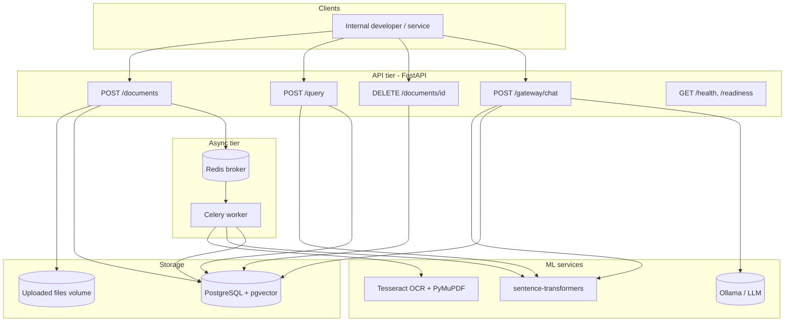
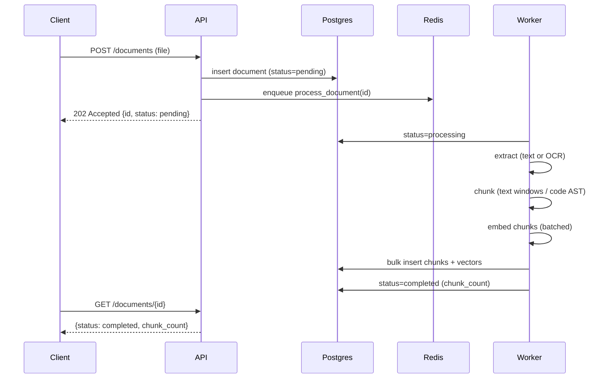
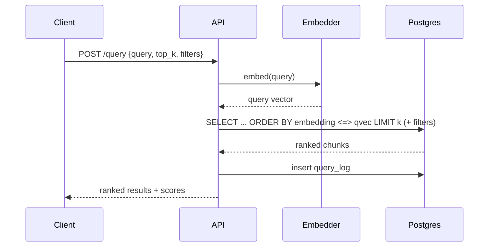

# System Architecture

## Overview

The platform is a RAG (Retrieval-Augmented Generation) backend split into a
synchronous **API tier** and an asynchronous **processing tier**, backed by a
single PostgreSQL database (with `pgvector`) that stores documents, chunks,
embeddings and query logs.

## Ingestion flow (async)

## Query flow

## Components

- **API tier (FastAPI)** - stateless; can be scaled horizontally behind a load
  balancer. Handles validation, persistence of metadata, enqueuing jobs, and
  synchronous read paths (query, gateway).
- **Async tier (Celery + Redis)** - decouples slow work (OCR, embedding) from
  the request path. Workers scale independently based on ingestion volume.
- **ML services** - embedding model loaded once per worker/process; OCR via
  Tesseract; optional LLM via the gateway abstraction.
- **PostgreSQL + pgvector** - single source of truth. Chosen so metadata,
  full-text content and vectors live together (transactional consistency,
  simpler ops, joins between chunks and document metadata for filtering).

## Design principles

- **Async-first ingestion** so uploads return immediately and large/slow files
  (e.g. a 22-page scanned PDF) don't block clients.
- **Provider abstraction** for both embeddings and LLMs, keeping model choice a
  configuration concern.
- **Graceful degradation** - the gateway returns retrieved context even when no
  LLM is configured; query logging never fails a request.
- **Idempotent, observable processing** - document status transitions
  (`pending -> processing -> completed/failed`) with stored error messages.
