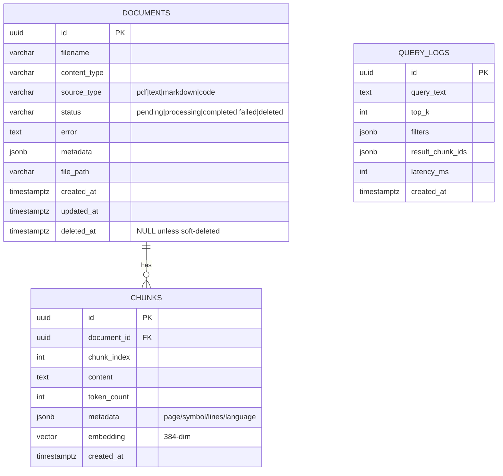

# Database Schema

PostgreSQL 16 with the `pgvector` extension. One database is the source of truth
for document metadata, chunk text, embeddings and query logs.

## Entity relationship

## Tables

### `documents`
Top-level record per uploaded file. `status` tracks the async pipeline;
`deleted_at` implements soft delete. `metadata` (JSONB) holds flexible
attributes (size, chunk_count, custom tags).

### `chunks`
One row per retrievable unit. `embedding` is a `vector(384)` column
(`all-MiniLM-L6-v2`). `metadata` carries provenance used for filtering and
display:
- text/PDF: `{ "page": N, "extraction": "text|ocr", "chunk_type": "text" }`
- code: `{ "symbol": "Class.method", "kind": "method", "start_line": N, "end_line": M, "language": "python", "chunk_type": "code" }`

### `query_logs`
Observability + analytics: what was asked, which chunks were returned, and
latency. Useful for evaluating retrieval quality over time.

## Indexing strategy

| Index | Purpose |
| --- | --- |
| `ix_chunks_embedding_hnsw` (HNSW, `vector_cosine_ops`) | Approximate nearest-neighbour vector search |
| `ix_chunks_document_id` (btree) | Fast chunk lookup / cascade deletes |
| `ix_chunks_metadata` (GIN on JSONB) | Metadata equality filters |
| `ix_documents_status`, `ix_documents_source_type`, `ix_documents_deleted_at` | Listing/filtering documents |
| `ix_query_logs_created_at` | Time-range analytics |

HNSW is chosen over IVFFlat for better recall/latency without needing a
pre-populated training step; it also handles incremental inserts well.

## Metadata modeling

Metadata is stored as JSONB rather than rigid columns so different source types
(pages vs. code symbols) coexist without schema churn, while the GIN index keeps
equality filters fast. Document-level filters (`source_type`, `document_id`) are
first-class columns for cheap joins.

## Query patterns

1. **Vector search with filter** - `JOIN documents` (exclude `deleted_at`),
   optional `source_type` / `document_id` / JSONB filters, `ORDER BY embedding
   <=> :q LIMIT k`.
2. **Status polling** - point lookup on `documents.id`.
3. **Listing** - filtered, paginated scan on `documents` ordered by `created_at`.

## Partitioning (future)

At current scale (~100 developers) partitioning is unnecessary. As data grows,
`chunks` is the natural candidate to partition by `document_id` hash or by
`created_at` range; query logs partition cleanly by month for cheap retention.

## Caching

- **Model cache** - embedding model loaded once per process.
- **Query cache (optional)** - Redis can cache `hash(query+filters) -> results`
  for popular queries with a short TTL.
- **Postgres buffer cache** keeps hot HNSW pages resident.

## Soft delete vs hard delete

- **Soft delete (default)**: set `deleted_at`; the row and its embeddings remain
  but are excluded from search/listing. Reversible and auditable; embeddings
  stay until a later purge.
- **Hard delete (`?hard=true`)**: remove the stored file, delete the document
  row (chunks/embeddings removed via `ON DELETE CASCADE`). Irreversible; used for
  compliance/space reclamation. Partial failures (e.g. missing file) are handled
  gracefully and reported.
